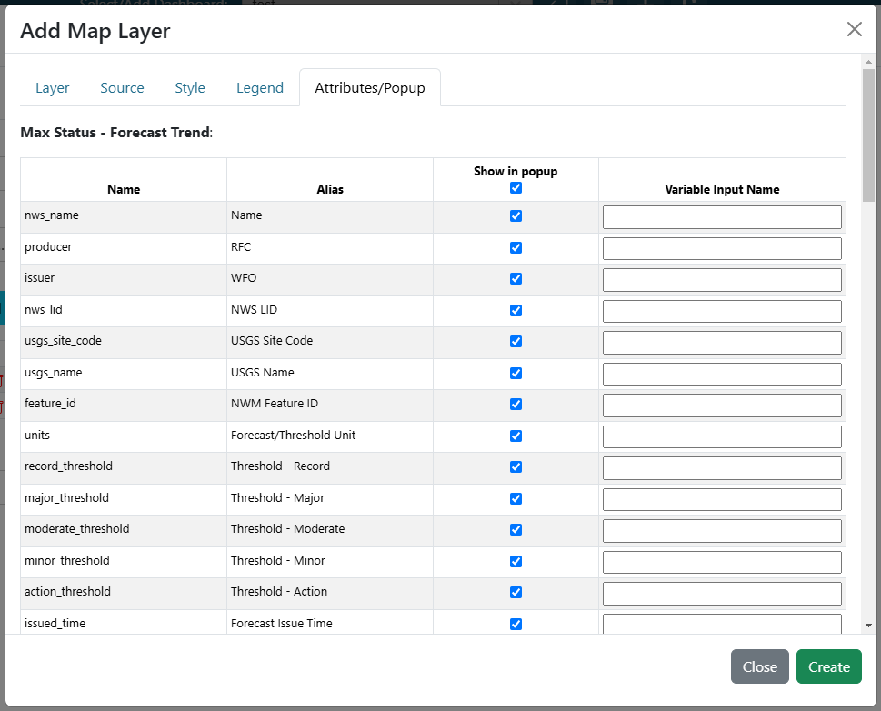

.. _attributes_and_popups_tab:

--------------------
Attributes/Popup Tab
--------------------

The Attributes/Popup tab is used to configure the interaction with the layer in the map once it is clicked.
**After the layer name and required source properties are configured**, then a table of layers and their attributes 
will be shown. 

Within this table, fields can be configured to handle click interaction in 2 ways:

    1- When a layer is clicked, a popup will be shown with the attributes for that selected feature(s). Attributes can be 
    configured to not be shown in popups by unchecking the "Show in popup" column.

    2- Fields can be configured to work with and update variable inputs. See the :ref:`variableinputs` section for more 
    information on how variable inputs work. In the "Variable Input Name" column of the table, add a desired variable input 
    for the field whose value will be used for the variable input when a feature is clicked. 

.. note::
    A variable input can be configured within the attributes table and not need its own variable input 
    visualization in the dashboard. For example, a chart can be configured to reference a new variable input.
    Then within the map, a field can use that new variable input for updating. Once a map feature is clicked, the 
    chart will automatically be updated with the configured field of the clicked layer, without the need to change 
    a dropdown or text input within the dashboard itself. An example of this is shown below.

    .. video:: ../videos/map_variable_input.mp4
        :autoplay:
        :loop:
        :class: variable-input-video

|

If the layer loads correctly, then a static table will be shown with the available attributes. 

|

If the layer loads incorrectly, then a dynamic table will be shown, in which the fields can be custom added. New rows 
can be created with tabbing through the inputs.

|

If the layer loads correctly but not attributes are found, then no table will be shown and a warning will appear, 
indicating that no attributes were found. 
