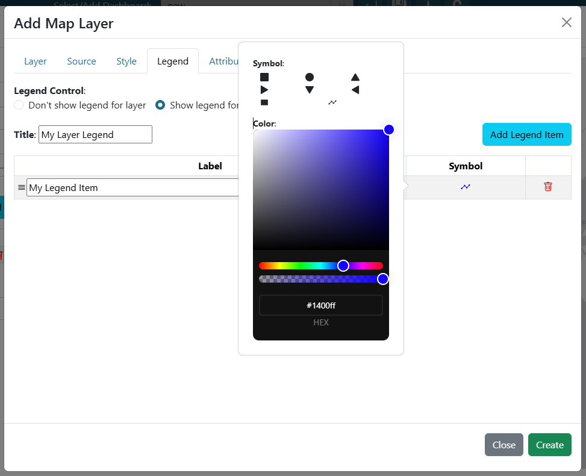

.. _legend_tab:

----------
Legend Tab
----------

The legend tab is used to configure a custom legend that will be show in the map legend menu. Legends for a specific 
layer can be toggled on or off. 

If a layer's legend is turned on, then users will need to provide a legend title and at least 1 legend item. New legend 
items can be added using the "Add Legend Item" button. Legend items can then be configured with a 
label and a symbol.

In order to configure the symbol, click on the symbol in the table row and a popup will then show with additional 
layer symbols and colors to choose from. 

|

