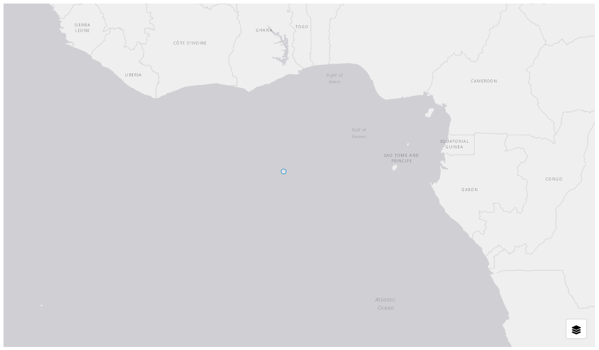
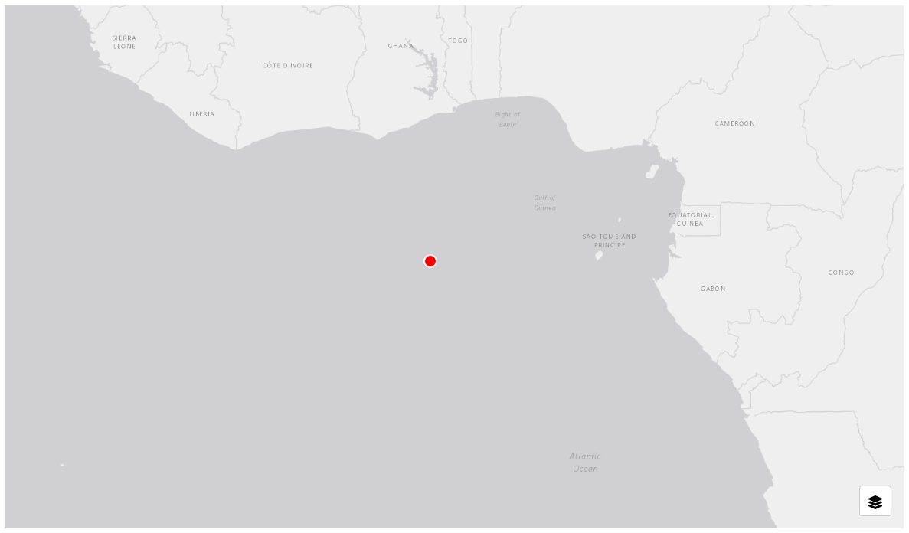

.. _style_tab:

---------
Style Tab
---------

The style tab allows layer to have custom styles. Custom styling for the configured layers follows the `MapLibre Style Spec <https://maplibre.org/maplibre-style-spec/>`_ 
standards for configuration and uses the `ol-mapbox-style applyStyle <https://openlayers.org/ol-mapbox-style/functions/applyStyle.html>`_ 
function for implementation. Make sure to follow the above links and documentation so that the layers render with the 
correct styling.

+++++++
Example
+++++++

GeoJSON::

    {
        "type": "FeatureCollection",
        "crs": {
            "properties": {
                "name": "EPSG:3857"
            }
        },
        "features": [
            {
                "type": "Feature",
                "geometry": {
                    "type": "Point",
                    "coordinates": [
                        0,
                        0
                    ]
                }
            }
        ]
    }

    GeoJSON layer without styling
|

Style JSON::

    {
        "version": 8,
        "sources": {
            "my-geojson-source": {
                "type": "geojson"
            }
        },
        "layers": [
            {
                "id": "points-layer",
                "type": "circle",
                "source": "my-geojson-source",
                "filter": [
                    "==",
                    "$type",
                    "Point"
                ],
                "paint": {
                    "circle-radius": 8,
                    "circle-color": "#FF0000",
                    "circle-stroke-width": 2,
                    "circle-stroke-color": "#FFFFFF"
                }
            }
        ]
    }

    GeoJSON layer with styling

|

.. warning::
    In order for styling to work, the "sources" key in the json object must correspond to the layer name from the layer 
    tab. For example, if the configured layer has a name of "My Beautiful Layer", then the styling json must look something 
    like::

        {
            "version": 8,
            "name": ...,
            "sprite": ...,
            "glyphs": ...,
            "sources": { 
                "My Beautiful Layer": {...}
            },
            "layers": [...]
        }
