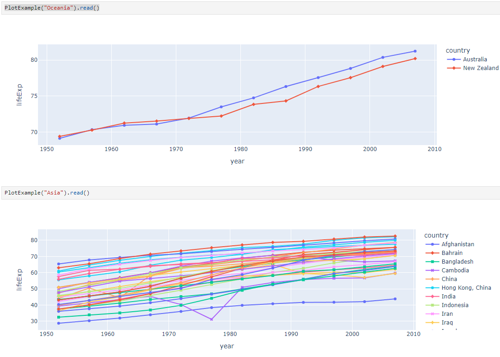

Visualization Plugins
=====================

.. _visualizationplugins:

Dashboard visualizations plugins are based on the `intake <https://github.com/intake/intake>`_ python package and can 
be developed following the information found in the 
`Making Driver <https://intake.readthedocs.io/en/latest/making-plugins.html>`_  documentation. This section will cover 
the requirements needed to make plugins specifically for this application, including necessary setup, properties, 
and methods. An example plugin can be found `here <https://github.com/FIRO-Tethys/tethysdash_plugin_usace/tree/main>`_.

Development
-----------

=====================
Creating a repository
=====================

Before developing a plugin, you will need to create a new repository for the plugin. This will ensure that others 
users can clone and install the package as needed. The file structure is up to the developer but the repository must 
include a setup.py, which will be addressed in the `Installation <Installation_>`_  section.

=======================
Intake DataSource Class
=======================

The focus of the development will be creating a new intake driver and datasource in the form of a python class. Below 
is an example of a simple intake driver example::

    from intake.source import base
    import plotly.express as px

    class PlotExample(base.DataSource):
        container = 'python'
        version = '0.0.1'
        name = 'plot_example'
        visualization_args = {"continent": "text"}
        visualization_group = "Example"
        visualization_label = "Example Plot"
        visualization_type = "plotly"

        def __init__(self, continent, github_kwargs={}, metadata=None):
            self.continent = continent
            super(PlotExample, self).__init__(metadata=metadata)

        def read(self):
            """Return a version of the xarray with all the data in memory"""
            df = px.data.gapminder().query(f"continent == '{self.continent}'")
            fig = px.line(df, x='year', y='lifeExp', color='country', symbol="country")
            return fig

The container, version, and name properties are all required by intake. For a more in depth review of properties and 
classes for base.DataSource, refer to the intake 
`documentation <https://intake.readthedocs.io/en/latest/making-plugins.html>`_.

Properties:
    - **container**: This will almost always be "python" which means the intake driver will return a python object.
    - **version**: version of the package
    - **name**: name of the package. This is the name that will be used for installation. In order to use the driver, you will call `intake.open_<driver_name>`.
    - **visualization_args**: This a property specific for the dashboard app. This is a dictionary containing the function arguments as keys with the data type as the value. This dictionary will be parsed in the application to dynamically create html inputs for the users. Values can be `HTML Input Types <https://www.w3schools.com/html/html_form_input_types.asp>`_ or a list of values for a dropdown menu (i.e. `{"year": "number", "location": "text", "available_colors": ["red", "blue", "white"]}`).
    - **visualization_group**: This a property specific for the dashboard app. List visualizations in the dashboard application will be grouped based on this property.
    - **visualization_label**: This a property specific for the dashboard app. Describes the formal name of the visualization that will be displayed in the visualization list in the dashboard app.
    - **visualization_type**: This a property specific for the dashboard app. Desribes the type of visualization this is created. Can be "plotly", "table", or "image". If another type is desired for the users, submit an issue in this repository requesting the new chart type.

Methods:
    - **init**: This is a typical python class **init** method. Set any class specific properties here for the visualization, such as the "continent" property in the example above.
    - **read**: This is the main function that developers will want to focus on. The dashboard app will call this method and use the results as the visualization data.

=======
Testing
=======

To test the plugin, simply run python in a command prompt or jupyter notebook, initialize the created class, and run 
the read method. As shown below, you can supply various arguments and run the desired workflows.

Installation
------------

Once the plugin is developed and working as desired, a setup file needs to be created so that the plugin can be 
installed and used by the dashboard app. If a setup.py file is being used, add the setup entry_point arguments as 
shown below. If multiple data sources have been created with the plugin, simply add to the intake.drivers list as 
needed.::

    setup(
        ...
        entry_points={
            'intake.drivers': [
                '<plugin_name> = <path_to_plugin_source>:<data_source_name>',
            ]
        },
        ...
    )

The entry point indicates that the python package is an intake driver. When the package is installed, the plugin will 
automatically be added to the intake registry for use. Replace the inserted values above with the necessary strings 
(i.e. 'usace_time_series = usace_visualizations.time_series:TimeSeries').

