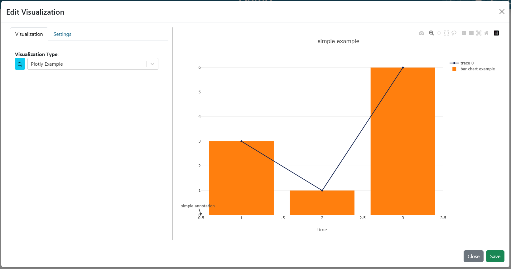
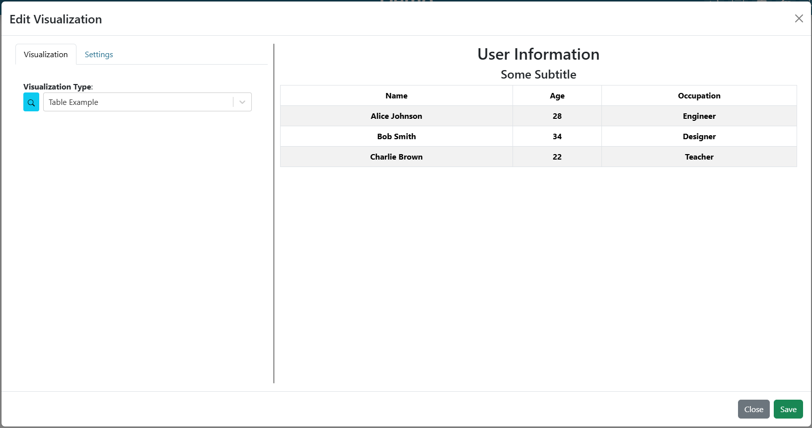
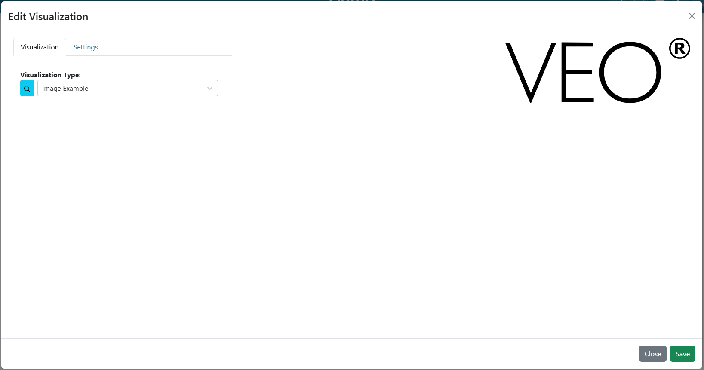
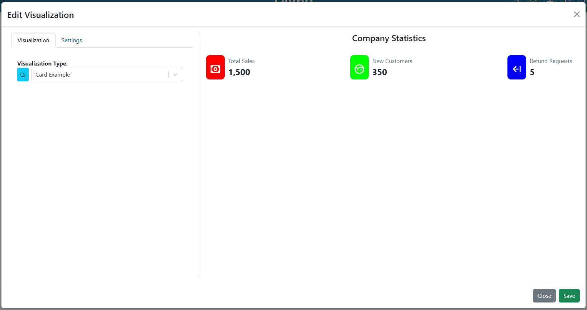
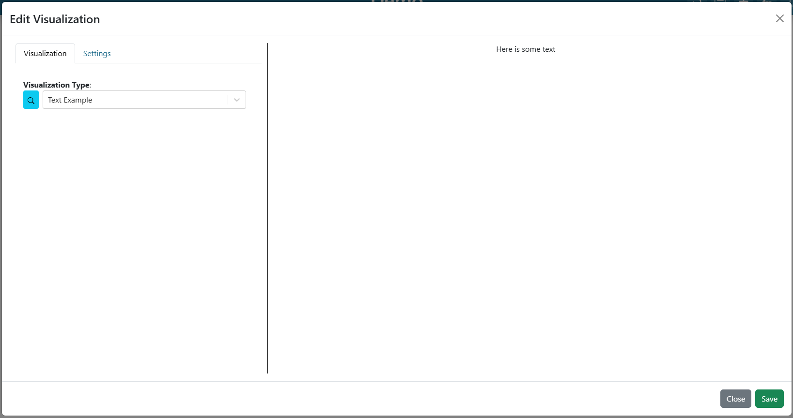
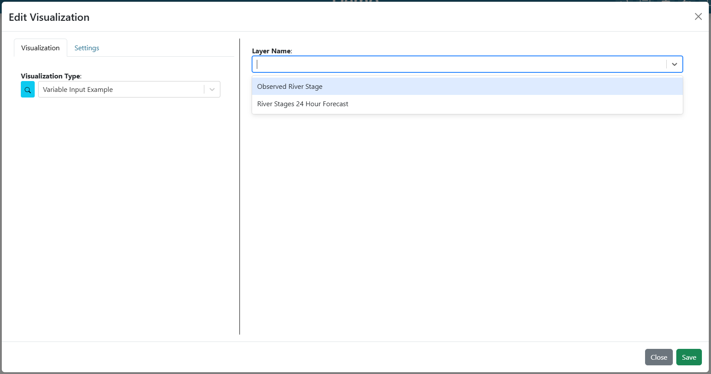
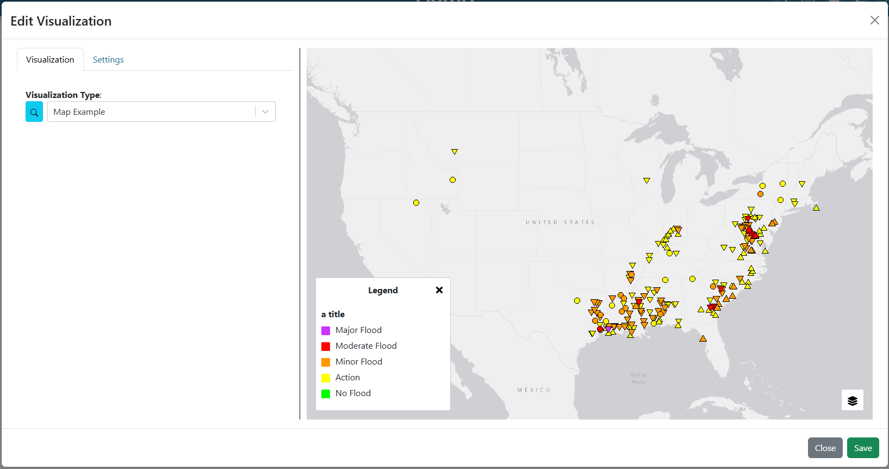

.. _visualizationplugins:

Visualization Plugins
=====================

Dashboard visualizations plugins are based on the `intake <https://github.com/intake/intake>`_ python package and can 
be developed following the information found in the 
`Making Driver <https://intake.readthedocs.io/en/latest/making-plugins.html>`_  documentation. This section will cover 
the requirements needed to make plugins specifically for this application, including necessary setup, properties, 
and methods. The `TethysDash Plugin Template respository <https://github.com/FIRO-Tethys/tethysdash_plugin_template>`_ is 
a good place to look at examples of how to create TethysDash plugins.

Development
-----------

=====================
Creating a repository
=====================

Before developing a plugin, a new repository will need to be created for the plugin. This will ensure that others 
users can clone and install the package as needed. The file structure is up to the developer but following the structure in 
the `TethysDash Plugin Template respository <https://github.com/FIRO-Tethys/tethysdash_plugin_template>`_ will ensure 
that they all work as expected. 

=======================
Intake DataSource Class
=======================

The focus of the development will be creating a new intake driver and datasource in the form of a python class. Below 
is an example of a simple intake driver example::

    from intake.source import base
    import plotly.express as px

    class PlotExample(base.DataSource):
        container = 'python'
        version = '0.0.1'
        name = 'plot_example'
        visualization_args = {"continent": "text"}
        visualization_group = "Example"
        visualization_label = "Example Plot"
        visualization_type = "plotly"

        def __init__(self, continent, github_kwargs={}, metadata=None. **kwargs):
            self.continent = continent
            super(PlotExample, self).__init__(metadata=metadata)

        def read(self):
            """Return a version of the xarray with all the data in memory"""
            df = px.data.gapminder().query(f"continent == '{self.continent}'")
            fig = px.line(df, x='year', y='lifeExp', color='country', symbol="country")
            return fig

The container, version, and name properties are all required by intake. For a more in depth review of properties and 
classes for base.DataSource, refer to the intake 
`documentation <https://intake.readthedocs.io/en/latest/making-plugins.html>`_.

Properties:
    - **container**: This will almost always be "python" which means the intake driver will return a python object.
    - **version**: version of the package
    - **name**: name of the package. This is the name that will be used for installation. When using the plugin, intake will open it using the syntax `intake.open_<driver_name>`.
    - **visualization_args**: This a property specific for the dashboard app. This is a dictionary containing the function arguments as keys with the data type as the value. This dictionary will be parsed in the application to dynamically create html inputs for the users. Values can be `HTML Input Types <https://www.w3schools.com/html/html_form_input_types.asp>`_ or a list of values for a dropdown menu (i.e. `{"year": "number", "location": "text", "available_colors": ["red", "blue", "white"]}`).
    - **visualization_group**: This a property specific for the dashboard app. List visualizations in the dashboard application will be grouped based on this property.
    - **visualization_label**: This a property specific for the dashboard app. Describes the formal name of the visualization that will be displayed in the visualization list in the dashboard app.
    - **visualization_type**: This a property specific for the dashboard app. Describes the type of visualization this is created. Can be "plotly", "table","image", "card", "map", or "custom". See the `Plugin Visualization Types <Plugin Visualization Types_>`_ section and the "Visualization Type Argument" for more information. 
    - **visualization_description**: This a property specific for the dashboard app. Provides a description of the visualization. 
    - **visualization_tags**: This a property specific for the dashboard app. An array of tags used for visualization search and discovery.
Methods:
    - **init**: This is a typical python class **init** method. Set any class specific properties here for the visualization, such as the "continent" property in the example above.
    - **read**: This is the main function that developers will want to focus on. The dashboard app will call this method and use the results as the visualization data.

==========================
Plugin Visualization Types
==========================

Plotly Chart
````````````

Displays a `Plotly <https://plotly.com/python/>`_ chart with the provided data, layout, and configuration. 



|

**visualization_type:** *plotly*

**read return: (dictionary)**
    - **data** (required): A list of plotly traces (see `Scatter Trace <https://plotly.com/javascript/reference/scatter/>`_ as an example)
    - **layout** (optional): A dictionary of a `Plotly Layout <https://plotly.com/python-api-reference/generated/plotly.graph_objects.Layout.html#plotly-graph-objs-layout>`_ configuration.
    - **config** (optional): A dictionary of a `Plotly Figure configuration <https://plotly.com/javascript/configuration-options/>`_ for adding buttons, interactions, etc.

**Example**: ::

    from intake.source import base

    class PlotlyExample(base.DataSource):
        container = "python"
        version = "0.0.1"
        name = "plotly_example"
        visualization_args = {}
        visualization_group = "Example"
        visualization_label = "Plotly Example"
        visualization_type = "plotly"
        visualization_tags = [
            "example",
            "plotly",
        ]
        visualization_description = "An example plugin for the plotly visualization"

        def __init__(self, metadata=None):
            super(PlotlyExample, self).__init__(metadata=metadata)

        def read(self):
            """
            Return plotly information
            """
            data = [
                {
                    "type": "scatter",  # all "scatter" attributes: https://plotly.com/javascript/reference/#scatter
                    "x": [1, 2, 3],  # more about "x": #scatter-x
                    "y": [3, 1, 6],  # #scatter-y
                    "marker": {  # marker is an object, valid marker keys: #scatter-marker
                        "color": "rgb(16, 32, 77)"  # more about "marker.color": #scatter-marker-color
                    },
                },
                {
                    "type": "bar",  # all "bar" chart attributes: #bar
                    "x": [1, 2, 3],  # more about "x": #bar-x
                    "y": [3, 1, 6],  # #bar-y
                    "name": "bar chart example",  # bar-name
                },
            ]

            layout = {  # all "layout" attributes: #layout
                "title": "simple example",  # more about "layout.title": #layout-title
                "xaxis": {  # all "layout.xaxis" attributes: #layout-xaxis
                    "title": "time"  # more about "layout.xaxis.title": #layout-xaxis-title
                },
                "annotations": [  # all "annotation" attributes: #layout-annotations
                    {
                        "text": "simple annotation",  # #layout-annotations-text
                        "x": 0,  # #layout-annotations-x
                        "xref": "paper",  # #layout-annotations-xref
                        "y": 0,  # #layout-annotations-y
                        "yref": "paper",  # #layout-annotations-yref
                    }
                ],
            }

            config = {"displayModeBar": True}

            return {"data": data, "layout": layout, "config": config}

|

Table
`````

Displays a table from the provided data.



|

**visualization_type:** *table*

**read return: (dictionary)**
    - **title** (required): The title to display above the table
    - **subtitle** (optional): The subtitle to display above the table
    - **data** (required): A list of dictionaries containing keys/values for columns and rows respectively.

**Example**: ::

    from intake.source import base

    class TableExample(base.DataSource):
        container = "python"
        version = "0.0.1"
        name = "table_example"
        visualization_args = {}
        visualization_group = "Example"
        visualization_label = "Table Example"
        visualization_type = "table"
        visualization_tags = [
            "example",
            "table",
        ]
        visualization_description = "An example plugin for the table visualization"

        def __init__(self, metadata=None):
            super(TableExample, self).__init__(metadata=metadata)

        def read(self):
            """
                Return table data
            """

            data = [
                {
                    "name": "Alice Johnson",
                    "age": 28,
                    "occupation": "Engineer",
                },
                {
                    "name": "Bob Smith",
                    "age": 34,
                    "occupation": "Designer",
                },
                {
                    "name": "Charlie Brown",
                    "age": 22,
                    "occupation": "Teacher",
                },
            ]
            title = "User Information"
            subtitle = "Some Subtitle"

            return {
                "title": title,
                "subtitle": subtitle,
                "data": data
            }

|

Image
`````

Displays an image based on the returned URL string.



|

**DataSource visualization_type value:** *image*

**read return: (string)**
    - A string containing the url to the image

**Example**: ::

    from intake.source import base


    class ImageExample(base.DataSource):
        container = "python"
        version = "0.0.1"
        name = "image_example"
        visualization_args = {}
        visualization_group = "Example"
        visualization_label = "Image Example"
        visualization_type = "image"
        visualization_tags = [
            "example",
            "image",
        ]
        visualization_description = "An example plugin for the image visualization"

        def __init__(self, metadata=None):
            super(ImageExample, self).__init__(metadata=metadata)

        def read(self):
            """
            Return an image url
            """

            return "https://aquaveo.com/pub/media/wysiwyg/aquaveo-logo-bw.svg"

|

Card
````

Displays a list of information in a card based fashion where each element in the dictionary can have its own color, 
value, label, and icon. 



|

**DataSource visualization_type value:** *card*

**read return: (dictionary)**
    - **title** (required): The title to display above the cards
    - **data** (required): A list of dictionaries containing the following keys.
        - **color** (Optional): hex or word based colors. Defaults to "black"
        - **label** (Optional): label for the card. Defaults to 0
        - **value** (Optional): value to display on the card. Defaults to "No Data Found"
        - **icon** (Optional): any `React Icon BI <https://react-icons.github.io/react-icons/icons/bi/>`_ icon

**Example**: ::

    from intake.source import base

    class CardExample(base.DataSource):
        container = "python"
        version = "0.0.1"
        name = "card_example"
        visualization_args = {}
        visualization_group = "Example"
        visualization_label = "Card Example"
        visualization_type = "card"
        visualization_tags = [
            "example",
            "card",
        ]
        visualization_description = "An example plugin for the card visualization"

        def __init__(self, metadata=None):
            super(CardExample, self).__init__(metadata=metadata)

        def read(self):
            """
                Return the data for the cards
            """

            data = [
                {
                    'color': '#ff0000', # Background color for the icon (in hex format)
                    'label': 'Total Sales', # Title or label for the statistic
                    'value': '1,500', # Value of the statistic
                    'icon': 'BiMoney' # Icon to display
                },
                {
                    'color': '#00ff00',
                    'label': 'New Customers',
                    'value': '350',
                    'icon': 'BiFace'
                },
                {
                    'color': '#0000ff',
                    'label': 'Refund Requests',
                    'value': '5',
                    'icon': 'BiArrowFromRight'
                },
            ]

            return {
                "title": "Company Statistics",
                "data": data
            }

|

Text
````

Displays custom text



|

**DataSource visualization_type value:** *text*

**read return: (dictionary)**
    - **text** (required): The text to show.

**Example**: ::

    from intake.source import base

    class TextExample(base.DataSource):
        container = "python"
        version = "0.0.1"
        name = "text_example"
        visualization_args = {}
        visualization_group = "Example"
        visualization_label = "Text Example"
        visualization_type = "text"
        visualization_tags = [
            "example",
            "text",
        ]
        visualization_description = "An example plugin for the text visualization"

        def __init__(self, metadata=None):
            super(TextExample, self).__init__(metadata=metadata)

        def read(self):
            """
                Return the data for the text
            """

            return {"text": "Here is some text"}

|

Variable Input
``````````````

Displays a variable input



|

**DataSource visualization_type value:** *variable_input*

**read return: (dictionary)**
    - **variable_name** (required): Name of the variable input
    - **initial_value** (required): Initial value of the variable input
    - **variable_options_source** (required): can be "text", "number", "checkbox", and array (as shown in the example)

**Example**: ::

    from intake.source import base

    class VariableInputExample(base.DataSource):
        container = "python"
        version = "0.0.1"
        name = "variable_input_example"
        visualization_args = {}
        visualization_group = "Example"
        visualization_label = "Variable Input Example"
        visualization_type = "variable_input"
        visualization_tags = [
            "example",
            "variable input",
        ]
        visualization_description = "An example plugin for the variable input visualization"

        def __init__(self, metadata=None):
            super(VariableInputExample, self).__init__(metadata=metadata)

        def read(self):
            """
                Return the data for the text
            """
            layer_names = [
                {"label": "Observed River Stage", "value": 0},
                {"label": "River Stages 24 Hour Forecast", "value": 1},
            ]

            return {
                "variable_name": "Layer Name",
                "initial_value": "",
                "variable_options_source": layer_names,
            }

|

Map
```

Displays a map with the given layers and configuration. The map visualization is based on OpenLayers and follows similar 
configurations for configs and layers.



|

**DataSource visualization_type value:** *map*

**read return: (dictionary)**
    - **baseMap** (required): string for ESRI BaseMap Layers
    - **viewConfig** (optional): Dictionary containing configurations for the map view. Check `OpenLayers documentation <https://openlayers.org/en/latest/apidoc/module-ol_View-View.html>`_ for more information.
    - **mapConfig** (optional): Dictionary containing configurations for the map view div.
    - **layers** (optional): A list of layers to include in the map. The following keys can be in each object in the array.
        - **configuration** (required): See maps :ref:`source_tab` for more information. 
        - **attributeVariables** (Optional): an object that maps a layers name (key) with the layers field and desired variable inputs to update the field value. See maps :ref:`attributes_and_popups_tab` for more information.
        - **legend** (required): an object that contains a title key and items key. The items key value is an array of object with label and color keys for the legend.
        - **style** (required): See maps :ref:`legend_tab` for more information.
    - **layerControl** (optional): A boolean indicating if a layer control should be available.

**Example**: ::

    from intake.source import base


    class Plots(base.DataSource):
        container = "python"
        version = "0.0.1"
        name = "map_example"
        visualization_args = {}
        visualization_group = "Example"
        visualization_label = "Map Example"
        visualization_type = "map"
        visualization_tags = [
            "example",
            "map",
        ]
        visualization_description = "An example plugin for the map visualization"

        def __init__(self, metadata=None, **kwargs):
            super(Plots, self).__init__(metadata=metadata)

        def read(self):

            return {
                "baseMap": "https://server.arcgisonline.com/arcgis/rest/services/Canvas/World_Light_Gray_Base/MapServer",
                "layers": [
                    {
                        "configuration": {
                            "type": "ImageLayer",
                            "props": {
                                "name": "asda",
                                "source": {
                                    "type": "ESRI Image and Map Service",
                                    "props": {
                                        "url": "https://maps.water.noaa.gov/server/rest/services/rfc/rfc_max_forecast/MapServer"
                                    },
                                },
                            },
                        },
                        "attributeVariables": {
                            "Max Status - Forecast Trend": {"nws_lid": "Location"}
                        },
                        "legend": {
                            "title": "a title",
                            "items": [
                                {
                                    "label": "Major Flood",
                                    "color": "#cc33ff",
                                },
                                {
                                    "label": "Moderate Flood",
                                    "color": "#ff0000",
                                },
                                {
                                    "label": "Minor Flood",
                                    "color": "#ff9900",
                                },
                                {
                                    "label": "Action",
                                    "color": "#ffff00",
                                },
                                {
                                    "label": "No Flood",
                                    "color": "#00ff00",
                                }
                            ],
                        },
                    },
                ],
                "layerControl": True,
            }

|

.. _custom_visualization:

Custom Visualization
````````````````````

Displays a custom visualization from a custom react component.


|

**Custom React Component**

    In order to use a custom react component, the custom react component must follow the 
    `Module Federation <https://webpack.js.org/concepts/module-federation/>`_ setup from webpack. An example of a 
    functioning custom component for tethysdash can be found in the 
    `tethysdash_custom_visualization_example <https://github.com/FIRO-Tethys/tethysdash_custom_visualization_example>`_ 
    repository. The follow files/configurations are needed to implement a custom component and come from the mentioned 
    repository.

    **Create the Component**

        The first step in implementing a custom react component is to creating it. Visit the 
        `React <https://react.dev/>`_ website to learn more about react and react components. 
        
        Below is an example of a simple react component that renders a `Hello World!` div. This component comes from 
        the `example repo <https://github.com/FIRO-Tethys/tethysdash_custom_visualization_example>`_, and resides in 
        `src/App.js` file.

        .. code-block:: javascript
            :linenos:
            :force:

            import React, { memo } from "react";

            const CustomComponent = () => {
                return <div>Hello World!</div>;
            };

            export default memo(CustomComponent);

    **webpack.config.js**

        Custom components must be exposed in the webpack configuration. In the example below on line 38, the 
        `CustomComponent` (object key) is being exposed from the `./src/App` path (object value). Multiple components 
        can be exposed by adding to the `exposes` object.

        The name of the module federation plugin in line 35 can also be upated and customized. This value will be used 
        in the python plugin as the `mfe_scope` value.

        .. code-block:: javascript
            :emphasize-lines: 4,7
            :lineno-start: 32
            :linenos:

            . . .
            plugins: [
                new ModuleFederationPlugin({
                    name: "custom_component_scope",
                    filename: "remoteEntry.js",
                    exposes: {
                        "./CustomComponent": "./src/App", // Adjusted path to exposed module
                    },
            ...

**Testing**

    In order to test that the created custom component is working as expected, some additional changes have to be 
    made to some files for the custom component to render in a browser. The following information is based on the 
    `example repo <https://github.com/FIRO-Tethys/tethysdash_custom_visualization_example>`_ and may be different 
    than other setups.

    **index.js**

        When running a local webpack server for component verification, the desired component needs to be 
        referenced. If using the `example repo <https://github.com/FIRO-Tethys/tethysdash_custom_visualization_example>`_, 
        the `src.index.js` is what will be ran from webpack.

        As in the example below, ensure that the custom component is being imported and then rendered.

        .. code-block:: javascript
            :emphasize-lines: 3,8
            :linenos:

            import React from "react";
            import ReactDOM from "react-dom/client";
            import CustomComponent from "./App";
            import "./index.css";

            const root = ReactDOM.createRoot(document.getElementById("root"));

            root.render(<CustomComponent />);
    
    **Running local webpack server**

        After ensuring that the custom component will be rendered, run a local webpack server by doing the following:

            1. Open a terminal
            2. cd into the folder with the code
            3. run ``npm install`` to install npm dependencies from the package.json file
            4. run ``npm start`` to start webpack server.
            5. Check the logs to find the locally hosted server and go to it. If using the `example repo <https://github.com/FIRO-Tethys/tethysdash_custom_visualization_example>`_, this will be `http://localhost:3000/ <http://localhost:3000/>`_
    
        
        .. image:: ../images/custom_react_component.png
            :align: center


    **Publishing**

        Once the package is ready to use, it must be built and published to npm with the following:

                1. Open a terminal
                2. cd into the folder with the code
                3. run ``npm run build``
                4. run ``npm publish``

        .. warning::
            Make sure to update the *package.json* file as needed, including the name of the package and the 
            necessary dependencies.

**Custom Python Component**

    **DataSource visualization_type value:** *custom*

    **read return: (dictionary)**

        - **url** (required): The url of the custom react component remoteEntry file. If using a published package, this is the url to the remoteEntry.js file from the unpkg url (i.e. https://unpkg.com/mfe-ol@latest/dist/remoteEntry.js). If testing locally, this is the url to the remoteEntry.js file from the locally host server (i.e. http://localhost:3000/remoteEntry.js)
        - **scope** (required): The name of the ModuleFederationPlugin found in the webpack.config.js file.
        - **module** (required): The react component that will be used. The value must match the keys found in the `exposes` property of the ModuleFederationPlugin (i.e. "./CustomComponent").
        - **props** (optional): A dictionary containing any necessary properties or arguments for the custom component.

    **Example**: ::

        from intake.source import base

        class CustomExample(base.DataSource):
            container = "python"
            version = "0.0.1"
            name = "custom_example"
            visualization_args = {}
            visualization_group = "Example"
            visualization_label = "Custom Example"
            visualization_type = "custom"

            def __init__(self, metadata=None):
                super(CustomExample, self).__init__(metadata=metadata)

            def read(self):
                """
                    Return the configuration for the custom component
                """
                mfe_unpkg_url = "http://localhost:3000/remoteEntry.js"
                # mfe_unpkg_url = "https://unpkg.com/mfe-ol@latest/dist/remoteEntry.js"
                mfe_scope = "custom_component_scope"
                mfe_module = "./CustomComponent"

                return {
                    "url": mfe_unpkg_url,
                    "scope": mfe_scope,
                    "module": mfe_module,
                }


|

=======
Testing
=======

To test the plugin, simply run python in a command prompt or jupyter notebook, initialize the created class, and run 
the read method. As shown below, various arguments and scenarios can be configured and run the desired workflows.


Installation
------------

Once the plugin is developed and working as desired, a setup file needs to be created so that the plugin can be 
installed and used by the dashboard app. If a setup.py file is being used, add the setup entry_point arguments as 
shown below. If multiple data sources have been created with the plugin, simply add to the intake.drivers list as 
needed.::

    setup(
        ...
        entry_points={
            'intake.drivers': [
                '<plugin_name> = <path_to_plugin_source>:<data_source_name>',
            ]
        },
        ...
    )
    
If a pyproject.toml file is being used, add the entry_point arguments as shown below.::

    [project.entry-points."intake.drivers"]
    <plugin_name> = "<path_to_plugin_source>:<data_source_name>"

The entry point indicates that the python package is an intake driver. When the package is installed, the plugin will 
automatically be added to the intake registry for use. Replace the inserted values above with the necessary strings 
(i.e. 'usace_time_series = usace_visualizations.time_series:TimeSeries').

