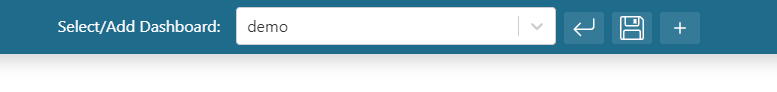
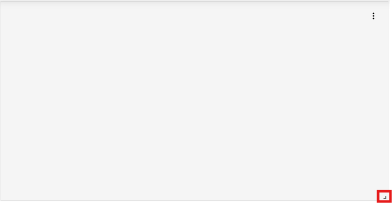
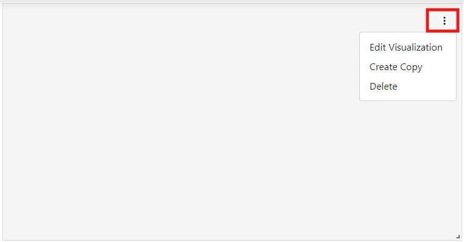
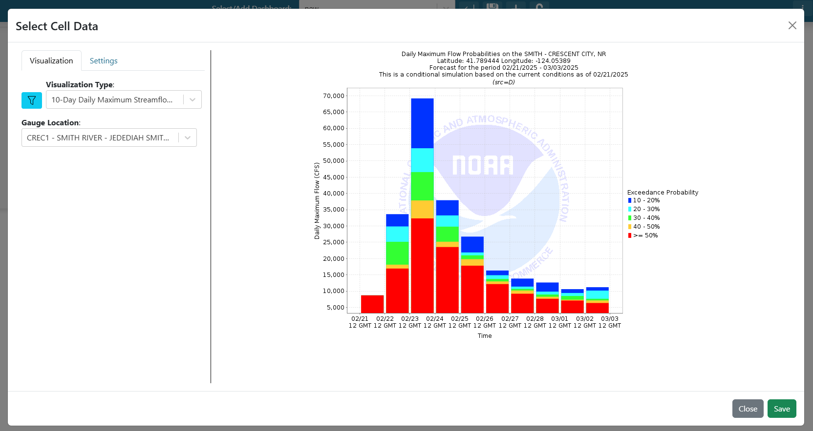
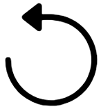
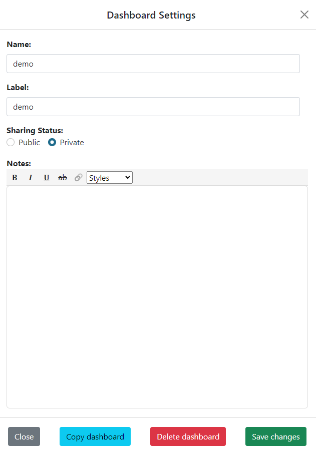

Dashboard Usage
===============

.. _dashboard_usage:

Create
------

To create a new dashboard, do the following:

   1. Click on the dropdown at the top of the application.
   2. Select "Create a New Dashboard"

.. image:: ../images/dashboard_creation.png
   :align: center

|

   3. Write the name of the desired dashboard in the popup

.. image:: ../images/dashboard_creation_prompt.png
   :align: center

|

   4. Click on the "Create" button

After creating the dashboard, the user will be taken to the newly created dashboard 
automatically. To learn more about editing the contents and settings of the dashboard, see the 
`Edit Dashboard Items <Edit Dashboard Items_>`_ and `Edit Dashboard Settings <Edit Dashboard Settings_>`_ sections.


Edit Dashboard Items
--------------------


.. |dashboard_add_item_button| image:: ../images/dashboard_add_item_button.png
   :scale: 50%

Users are only able to edit dashboards that they have created. Once a user created dashboard is selected, 
click on the |dashboard_edit_button| button next to the dashboard dropdown at the top of the app to turn 
on edit mode. Once in edit mode, additional buttons for reverting changes, saving changes, and adding new 
dashboard items will appear.



================
Adding New Items
================

Once in edit mode, simply click on the "Add Dashboard Item" (|dashboard_add_item_button|) button in the 
application header.

============
Moving Items
============

Once in edit mode, each dashboard item can be moved by clicking and holding inside the item and then dragging 
the mouse to the desired location. The salmon colored background will indicate when the item will settle once the user 
stops holding down the click. 

==============
Resizing Items
==============

Once in edit mode, each dashboard item can be resized by dragging on the resize handler in the bottom right corner 
of the item



======================================================
Editing Item Visualizations and Visualization Settings
======================================================

Once in edit mode, each dashboard item will have a 3 dot menu in the top right corner. Click on the 3 dot menu and 
select the "Edit Visualization" option. The left side menu is used to configure the desired visualization. The right 
side is a preview so that the user can know exactly what they will be seeing in the dashboard.



A popup will appear where the user can search available visualization options and select the desired configuration for 
the dashboard item. For more information about visualizations and creating new options, see the :doc:`plugins` section.

------------
Refresh Rate
------------

The refresh rate indicates how often a visualization should update automatically on the dashboard. This setting is 
used for when visualizations may update due to new data being available. Instead of having to refresh the entire 
dashboard to check for new data, this setting will do it automatically at the desired refresh rate for the specified 
dashboard item. A refresh rate of 0 indicates that it will not refresh.

-------------------------------------------
Visualization Type and Additional Arguments
-------------------------------------------

Determines the type of visualization that will be displayed. Once a visualization type is selected, more 
options/arguments may appear that are visualization specific. These additional arguments are used to select specific 
values needed for the visualizations.

For example, if an option is selected for a chart that shows a hydrologic forecast, the visualization also needs to 
know which location to check. In this example, a new option may appear so that the user can choose which location to 
view.



.. tip::

   Users can type with dropdowns to search for and subset options as shown below.
   
   .. image:: ../images/dropdown_search.png
      :align: center

`````````````````````
Custom Visualizations
`````````````````````
Most visualizations that are available are custom visualizations based on installed plugins. For more information about 
visualizations, see the :doc:`plugins` section.

Additional Arguments:
   - Additional Arguments shown for custom visualizations are dependent on the visualization and will dynamically update depending on the selection.

````````````
Custom Image
````````````
This visualization will allow users to add a publicly accessible image to their dashboards. 

Additional Arguments:
   - **Image Source:** A url to the image.

````
Text
````
This visualization will allow users to display text. Users can write the text on the right side of the modal and add 
headings and styles as desired. 

``````````````
Variable Input
``````````````
This visualization will create a variable that can be refenced from other visualizations for dynamic changing of 
dashboard items. For more information on how this works, see the :doc:`variable_inputs` section

Additional Arguments:
   - **Variable Name:** Name of the variable input
   - **Variable Options Source:** Refers to the type of variable input and where the possible values can be derived from.

--------------------------
Saving Item Visualizations
--------------------------
Once the visualization is configured correctly, click on the "Save" button in the bottom right corner to save the 
changes and return to the dashboard with the newly configured dashboard item.

=============
Copying Items
=============

Once in edit mode, each dashboard item will have a 3 dot menu in the top right corner. Click on the 3 dot menu and 
select the "Create Copy" option. A new dashboard items will be created with the same settings and visualization.

==============
Deleting Items
==============

Once in edit mode, each dashboard item will have a 3 dot menu in the top right corner. Click on the 3 dot menu and 
select the "Delete" option. You will be prompted if you would actually like to delete the dashboard item. Click "OK" to 
delete or click "cancel" to not delete it.

====================
Saving Configuration
====================

.. |dashboard_save_button| image:: ../images/dashboard_save_button.png
   :scale: 50%

Users can save their dashboard configuration by clicking on the |dashboard_save_button| button next to the dashboard 
dropdown at the top of the app. These saved changes will persist when the application is refreshed or revisited. 

.. warning::

   All changes to the dashboard will be lost if exiting the application without saving. Make sure to save frequently.


=======================
Reverting Configuration
=======================



Users can revert their dashboard configuration to the previously saved sate by clicking on the 
|dashboard_revert_button| button next to the dashboard dropdown at the top of the application.


Edit Dashboard Settings
-----------------------

.. |dashboard_settings_button| image:: ../images/dashboard_settings_button.png
   :scale: 50%

When a dashboard is selected in the dashboard dropdown, a hamburger (|dashboard_settings_button|) button will appear 
on the left in the application header. Click on the hamburger button to open up the dashboard settings menu. If the 
selected dashboard was created by the user, then all settings can be changed and saved.



====
Name
====

Indicates the dashboard name. This is the text that will appear in the url for a public dashboard. Dashboard names can 
only be letters and numbers and cannot include any special characters.

Users cannot create multiple dashboards of their own with the same name. A dashboard with the same name as a public 
dashboard can be created but it cannot be made public with that same name.

=====
Label
=====

Indicates the dashboard label. This is the text that will appear in the dashboard dropdown and can include spaces and 
special characters.

Users cannot create multiple dashboards of their own with the same label. A dashboard with the same label as a public 
dashboard can be created but it cannot be made public with that same label.

==============
Sharing Status
==============

Indicates if the dashboard will be private (only accessible to the user) or public (accessible to anyone). Public 
dashboards are accessible to anyone but can only be edited by the user who created it.

No public dashboards can have the same name or the same label.

=====
Notes
=====

Users can write, save, and edit notes for the dashboard. For public dashboards, these notes can be seen by anyone 
that accesses the dashboard.

=========================
Saving Dashboard Settings
=========================

To persist any setting changes, click on the "Save changes" button on the bottom of the dashboard settings panel.


Share
-----

Dashboards can be shared publicly and accessible by anyone. Users can only share dashboards that they have created. To 
share an existing dashboard, perform the following steps:

   1. Select the desired dashboard that you would like to share. 
   2. Click on the hamburger (|dashboard_settings_button|) button on left in the header to open up the settings.
   3. Under the "Sharing Status" option, Click on the "Public" option.
   4. Click on the "Save change" button at the bottom of the settings panel to save the new sharing status of the dashboard.

Copy
----

To copy an existing dashboard, perform the following steps:

   1. Select the desired dashboard that you would like to copy. 
   2. Click on the hamburger (|dashboard_settings_button|) button on left in the header to open up the settings.
   3. Click on the "Copy dashboard" button at the bottom of the settings panel.


Delete
------

To delete an existing dashboard, perform the following steps:

   1. Select the desired dashboard that you would like to delete. 
   2. Click on the hamburger (|dashboard_settings_button|) button on left in the header to open up the settings.
   3. Click on the "Delete dashboard" button at the bottom of the settings panel.
   4. You will be prompted if you would actually like to delete the dashboard. Click "OK" to delete or click "cancel" to not delete it.

