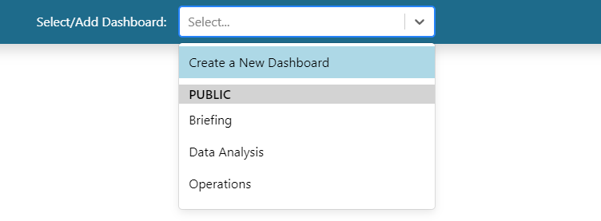
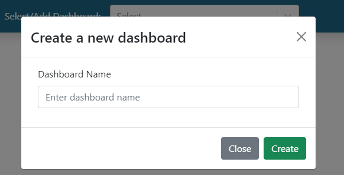

Dashboard Usage
===============

.. _dashboard_usage:

Create
------

To create a new dashboard, do the following:

   1. Click on the dropdown at the top of the application.
   2. Select "Create a New Dashboard"

|

   3. Write the name of your desired dashboard in the popup

|

   4. Click on the "Create" button

After creating the dashboard, you will be taken to the newly created dashboard 
automatically. To learn more about editing the contents and settings of the dashboard, see the `Edit <Edit_>`_ section.

Edit
----

Share
-----

Copy
----

Delete
------

