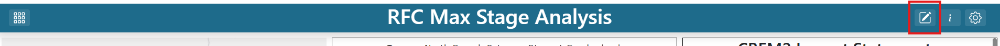
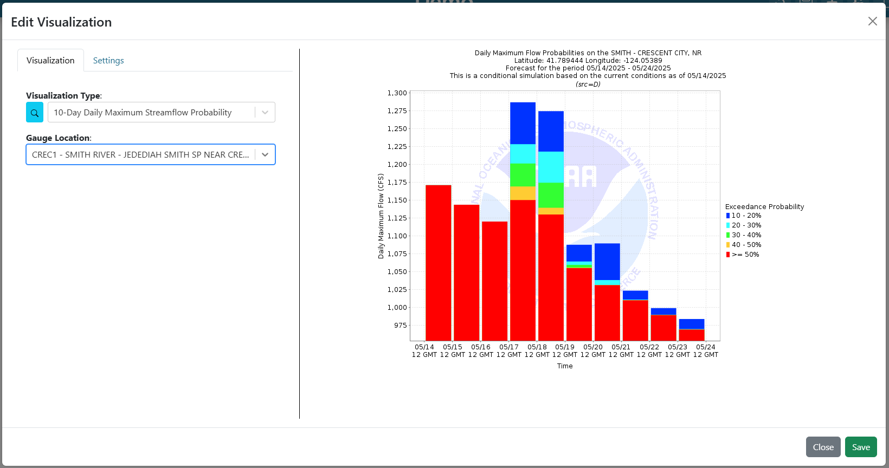

Dashboard Usage
===============

.. _dashboard_usage:

Create
------

To create a new dashboard, do the following:

   1. Click on the dropdown at the top of the application.
   2. Select "Create a New Dashboard"

.. image:: ../images/dashboard_creation.png

|

   3. Write the name of the desired dashboard in the popup

.. image:: ../images/dashboard_creation_prompt.png

|

   4. Click on the "Create" button

After creating the dashboard, the user will be taken to the newly created dashboard 
automatically. To learn more about editing the contents and settings of the dashboard, see the 
`Edit Dashboard Items <Edit Dashboard Items_>`_ and `Edit Dashboard Settings <Edit Dashboard Settings_>`_ sections.

Edit Dashboard Items
--------------------

.. |dashboard_edit_button| image:: ../images/dashboard_edit_button.png
   :scale: 50%

.. |dashboard_add_item_button| image:: ../images/dashboard_add_item_button.png
   :scale: 50%

Users are only able to edit dashboards that they have created. Once a user created dashboard is selected, 
click on the |dashboard_edit_button| button next to the dashboard dropdown at the top of the app to turn 
on edit mode. Once in edit mode, additional buttons for reverting changes, saving changes, and adding new 
dashboard items will appear.

================
Adding New Items
================

Once in edit mode, simply click on the "Add Dashboard Item" (|dashboard_add_item_button|) button in the 
application header.

============
Moving Items
============

Once in edit mode, each dashboard item can be moved by clicking and holding inside the item and then dragging 
the mouse to the desired location. The salmon colored background will indicate when the item will settle once the user 
stops holding down the click. 

==============
Resizing Items
==============

Once in edit mode, each dashboard item can be resized by dragging on the resize handler in the bottom right corner 
of the item

.. image:: ../images/dashboard_resize_handler.png

======================================================
Editing Item Visualizations and Visualization Settings
======================================================

Once in edit mode, each dashboard item will have a 3 dot menu in the top right corner. Click on the 3 dot menu and 
select the "Edit Visualization" option. The left side menu is used to configure the desired visualization. The right 
side is a preview so that the user can know exactly what they will be seeing in the dashboard.

.. image:: ../images/dashboard_edit_menu.png

A popup will appear where the user can search available visualization options and select the desired configuration for 
the dashboard item. For more information about visualizations and creating new options, see the :doc:`plugins` section.

------------
Refresh Rate
------------

The refresh rate indicates how often a visualization should update automatically on the dashboard. This setting is 
used for when visualizations may update due to new data being available. Instead of having to refresh the entire 
dashboard to check for new data, this setting will do it automatically at the desired refresh rate for the specified 
dashboard item. A refresh rate of 0 indicates that it will not refresh.

------------------
Visualization Type
------------------

The visualization type is a list of available visualizations based on installed plugins. For more information about 
visualizations and creating new options, see the :doc:`plugins` section. Click on the drowdown and select the desired 
visualization.

---------------------------------
Visualization Arguments (Dynamic)
---------------------------------
Once a visualization type is selected, more options/arguments may appear that are visualization specific. 

For example, if an option is selected for a chart that shows a hydrologic forecast, the visualization also needs to 
know which location to check. In this example, a new option may appear so that the user can choose which loction to 
view.

.. tip::

   Users can type with dropdowns to search for and subset options as shown below.
   
   .. image:: ../images/dropdown_search.png

--------------------------
Saving Item Visualizations
--------------------------
Once the visualization is configured correctly, click on the "Save" button in the bottom right corner to save the 
changes and return to the dashboard with the newly configured dashboard item

==============================
Saving Dashboard Configuration
==============================

Users can save their dashboard configuration by clicking on the |dashboard_save_button| button next to the dashboard 
dropdown at the top of the app. These saved changes will persist when the application is refreshed or revisited. 

.. warning::

   All changes to the dashboard will be lost if exiting the application without saving. Make sure to save frequently.

Edit Dashboard Settings
-----------------------

Share
-----

Copy
----

Delete
------

