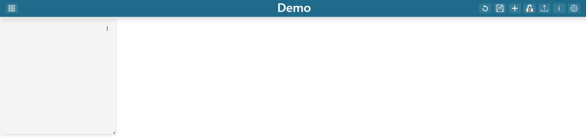

Adding New Items
----------------

.. _add_dashboard_items:

.. |dashboard_add_item_button| image:: ../../images/dashboard_add_item_button.png
   :scale: 50%

Once in edit mode, Click on the "Add Dashboard Item" (|dashboard_add_item_button|) button in the 
application header.

|

Once clicked a new dashboard item will appear at the bottom of the dashboard.

|
