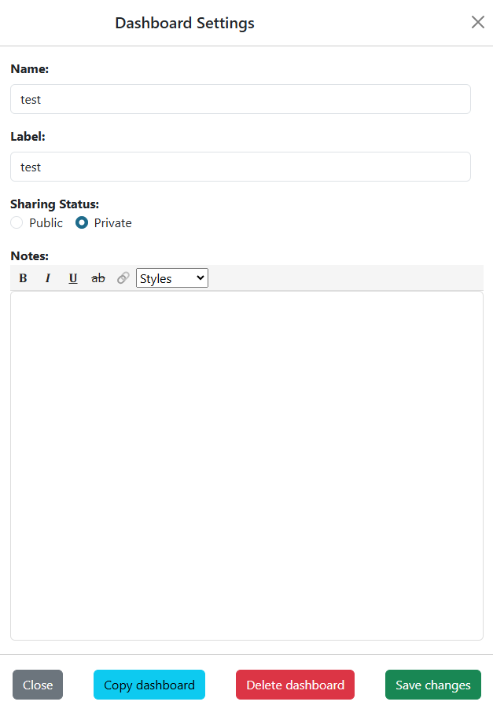

.. _copy_dashboard:

Copy a Dashboard
================

.. |dashboard_settings_button| image:: ../../images/dashboard_settings_button.png
   :scale: 50%

To copy an existing dashboard, perform the following steps:

   1. Select the desired dashboard to copy. 
   2. Click on the hamburger (|dashboard_settings_button|) button on left in the header to open up the settings.
   3. Click on the "Copy dashboard" button at the bottom of the settings panel.

|
