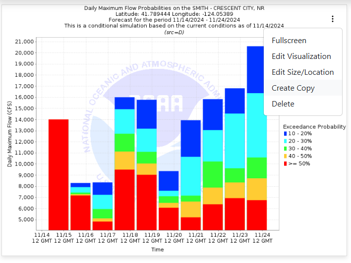

.. _copy_dashboard_items:

Copying Items
-------------

Once in edit mode, each dashboard item will have a 3 dot menu in the top right corner. Click on the 3 dot menu and 
select the "Create Copy" option. A new dashboard items will be created with the same settings and visualization.

|
