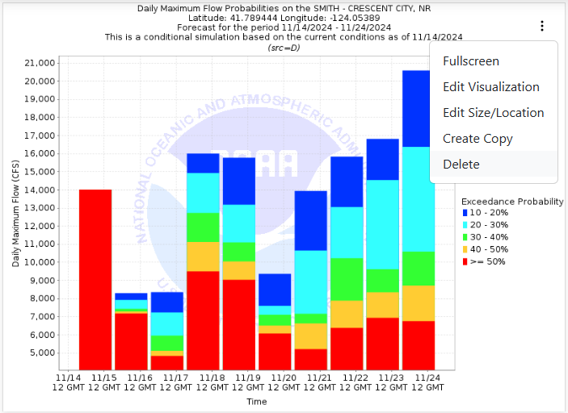

Deleting Items
--------------

.. _delete_dashboard_items:

Once in edit mode, each dashboard item will have a 3 dot menu in the top right corner. Click on the 3 dot menu and 
select the "Delete" option. You will be prompted if you would actually like to delete the dashboard item. Click "OK" to 
delete or click "cancel" to not delete it.

|