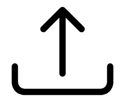

.. _landing_page:

Landing Page
============

The TethysDash landing page provides a summary of all available dashboards for the user. This includes dashboards that are 
owned by the user as well as all dashboards that are shared publicly.

Landing Page
   .. image:: ../../images/landing_page.png
      :align: center

Dashboard Cards
---------------

Each card in the landing page represents an available dashboard and provides information such as the name, description, owner status, public status, and 
a thumbnail. User dashboards are represented by the owner icon (|owner_icon|) in top left of the card. Public dashboards are represented by 
the public icon (|public_icon|) in top left of the card. Users can view the dashboard description by hovering over the card. The 3 dot menu on the 
top right of the card provides additional actions.

Creating a Dashboard
--------------------

In order to create a new dashboard, ensure that you are signed into the tethys portal. If a login inco (|login_icon|) is shown 
in the header of the app, click on it and sign in. 

If you are signed into the portal, then there will be a blank dashboard card with the text "Create a New Dashboard". Click on 
the "Create a New Dashboard" card, provide the name and description, and then click on the "Create" button.

Dashboard Card Context Menu
---------------------------

   .. image:: ../../images/dashboard_context_menu.png
      :align: center

   **Open**: Open and view the contents of the dashboard. Users can also double click on the card to open the dashboard.

   **Rename** (*Ownership Required*): Rename the dashboard.

   **Update Description** (*Ownership Required*): Update the dashboard description.

   **Update Thumbnail** (*Ownership Required*): Update the dashboard thumbnail.

   **Share --> Make Public** (*Ownership Required*): Share the dashboard so that it can be viewed by anyone. Other viewers will have read-only access.

   **Share --> Copy Public URL**: Copy the public url to the clipboard.

   **Share --> Make Private** (*Ownership Required*): Remove public access to the dashboard.

   **Copy** (*Sign In Required*): Create a copy of the dashboard for the user.

   **Export**: Export the dashboard into a JSON file.

   **Delete**: (*Ownership Required*): Delete the dashboard.

Importing Dashboards
--------------------

In order to provide an easier way to share and update dashboards between tethysdash instances, dashboards can be imported 
using a structured JSON format. To import a dashboard, click on the dashboard import icon (|dashboard_import_icon|) in the 
header of the landing page. You will then be prompted to chose a json file and import the file. 

The structure of the JSON should be the following:

.. code-block:: json

   {
      "name": "dashboard name",
      "description": "dashboard description",
      "accessGroups": ["public"], // add "public" to the array to make it public or leave the array empty to make it private
      "unrestrictedPlacement": false, // determines if dashboard items can overlap and be placed anywhere
      "notes": "dashboard notes", // notes that can be viewed with the dashboard
      "gridItems": [ // each object within the array represents and individual item within the dashboard
         {
            "i": 1, // a unique integer id for the item
            "x": 0, // x coordinate of the top left corner
            "y": 0, // y coordinate of the top left corner
            "w": 33, // width (based on the grid size) of the item
            "h": 44, // height (based on the grid size) of the item
            "source": "cnrfc_10day_daily_maximum_streamflow_probability", // this refers to the intake driver name used for the visualization. This is just an example
            "args_string": { // any necessary arguments for the intake driver. This is just an example
               "gauge_location": "CREC1"
            },
            "metadata_string": { // any custom settings for the item. This is just an example. See below for possible options
               "border": {
                  "border": "1px solid black"
               },
               "customMessaging": {
                  "error": "A custom error"
               }
            }
         }
      ]
   }

The following options are available for the metadata_string key:
   
   * **border** (object)
      * **border**: Determines the style for all borders. Value follows the CSS pattern for defining a border e.g. "1px solid black".
      * **border-bottom**: Determines the style for the bottom border. Value follows the CSS pattern for defining a border e.g. "1px solid black".
      * **border-top**: Determines the style for the top border. Value follows the CSS pattern for defining a border e.g. "1px solid black".
      * **border-left**: Determines the style for the left border. Value follows the CSS pattern for defining a border e.g. "1px solid black".
      * **border-right**: Determines the style for the right border. Value follows the CSS pattern for defining a border e.g. "1px solid black".
   
   * **boxShadow** (string): Determines the style for the box shadow around the item. Value follows the CSS pattern for defining a box shadow e.g. "4px 0 8px black".
   
   * **backgroundColor** (string): Determines the style for the background color of the item. Value follows the CSS pattern for defining colors (simple name, hex, etc)
   
   * **customMessaging** (object)
      * **error**: A custom error to show when the visualization processing has an error.
      * **<Variable Input Name>**: A custom message to show when the provided Variable Input has no value.
   
   * **refreshRate** (integer): Determines the time interval for which the visualization will be refreshed to get newest information
  
   * Any additional settings for specific visualizations (see :ref:`settings_tab`)

