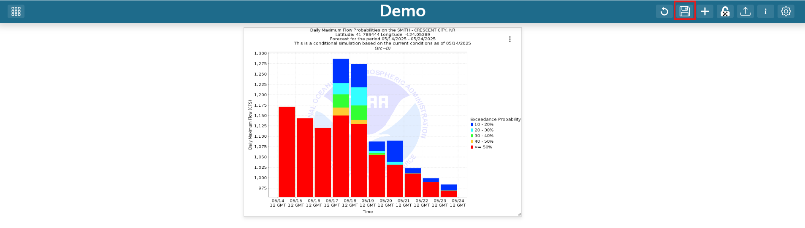

.. _save_dashboard_items:

Saving Items
------------

.. |dashboard_save_button| image:: ../../images/dashboard_save_button.png
   :scale: 50%

Users can save their dashboard configuration by clicking on the |dashboard_save_button| button in the app header. 
These saved changes will persist when the application is refreshed or revisited. 

|

.. warning::

   All changes to the dashboard will be lost if exiting the application without saving. Make sure to save frequently.
