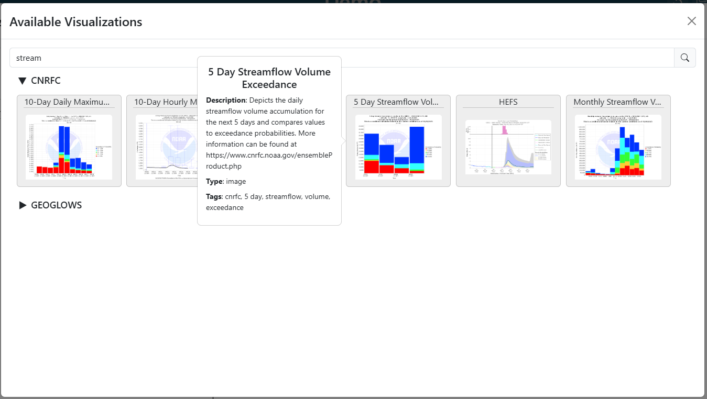

.. _visualization_tab:

Visualization Tab
-----------------


The visualization tab is used to select and configure the visualization that will be shown within the dashboard item.

``````````````````
Visualization Type
``````````````````
.. |search_visualizations_button| image:: ../../images/search_visualizations_button.png
   :scale: 10%

Determines the type of visualization that will be displayed. For more information about visualizations and creating 
new options, see the :doc:`../plugins` section. 

The visualization type can be selected from the dropdown or visualization can be search and discovered using the search 
(|search_visualizations_button|) button. When the search button is clicked, you will them see a pop with sections and thumbnails
for every available visualization. You can search for visualizations by tag and name. You can also hover over the cards 
to see a description, tags, and type of visualization that it will produce.



|

.. tip::

   Users can type with dropdowns to search for and subset options as shown below. They can also add a new option through typing 
   and selecting the 'Use ...' option.
   
   .. image:: ../../images/dropdown_search.png
      :align: center

|

```````````````````````
Visualization Arguments
```````````````````````
Once a visualization type is selected, more options/arguments may appear  that are visualization specific. These 
additional arguments are used to select specific values needed for the visualizations. 

For example, if an option is selected for a chart that shows a hydrologic forecast, the visualization also needs to 
know which location to check. In this example, a new option may appear so that the user can choose which location to 
view.

.. image:: ../../images/dashboard_edit_visualization.png
   :align: center

|

:::::::::::::::::::::
Custom Visualizations
:::::::::::::::::::::
Most visualizations that are available are custom visualizations based on installed plugins. For more information about 
visualizations, see the :doc:`../plugins` section.

Additional Arguments:
   - Additional Arguments shown for custom visualizations are dependent on the visualization and will dynamically update depending on the selection.

------------------------------------------------------------------------------------------------------------------------

:::
Map
:::
This visualization will allow users to add a map to their dashboards. For more information about creating a map, see the :ref:`maps` section 

Additional Arguments:
   - **Base Map:** A list of available basemaps to use for the map
   - **Additional Layers:** Click on the "Add Layer" button to add to new layer to the map. Users can also edit or delete existing layers from the provide summary table
   - **Show Layer Controls:** Determines if a layer control menu will be added to the map for users to toggle layers
    
------------------------------------------------------------------------------------------------------------------------

::::::::::::
Custom Image
::::::::::::
This visualization will allow users to add a publicly accessible image to their dashboards. 

Additional Arguments:
   - **Image Source:** A url to the image.

------------------------------------------------------------------------------------------------------------------------

::::
Text
::::
This visualization will allow users to display text. Users can write the text on the right side of the modal and add 
headings and styles as desired. 

------------------------------------------------------------------------------------------------------------------------

::::::::::::::
Variable Input
::::::::::::::
This visualization will create a variable that can be refenced from other visualizations for dynamic changing of 
dashboard items. For more information on how this works, see the :doc:`../variable_inputs` section

Additional Arguments:
   - **Variable Name:** Name of the variable input
   - **Variable Options Source:** Refers to the type of variable input and where the possible values can be derived from.

|