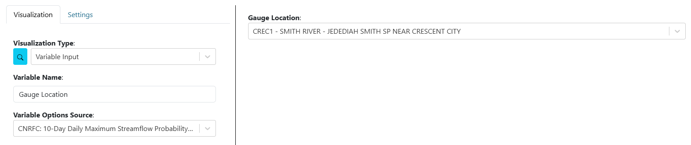

.. _variableinputs:

Variable Inputs
===============

Variable inputs are a way to make dashboards more dynamic. Instead of making multiple dashboards to view the same 
visualizations with slightly different arguments, users can use variable inputs to dynamically change visualizations 
within the dashboards.

In the example below, a user can use variable inputs to simplify data analysis for multiple sites. Instead of creating 
3 unique dashboards to view similar data for 3 different gauge locations, a user can make a single dashboard with 
visualizations that are tied to a variable input dropdown. When the user updates the variable input dropdown, the 
connected visualizations will automatically recognize the change and update accordingly.

.. video:: ../videos/variable_input_example.mp4
    :autoplay:
    :loop:
    :class: variable-input-video

|

Set Up
------

To setup a variable input, perform the following:

    1. Edit the visualization of a dashboard item. See :ref:`edit_dashboard_items` for more information if needed.
    2. For the "Visualization Type" option, select "Variable Input".
    3. For the "Variable Name" option, set the label/name of the variable.
    4. For the "Variable Options Source" option, users can select from a several options:

        - **text:** This will create a text based HTML input with a visualization refresh button. 
        - **number:** This will create a number based HTML input with a visualization refresh button.
        - **checkbox:** This will create a checkbox HTML input.
        - **EXISTING VISUALIZATION INPUTS:** The options under this item are derived from arguments for installed visualization plugins. Selecting one of these options will imitate the visualization argument but make it a variable input.

|

Connecting to Visualizations
----------------------------

After a variable input has been created, users must connect visualizations to the variable inputs in order to use them. 
To connect variable inputs, perform the following:

    1. Edit the visualization of a dashboard item. See :ref:`edit_dashboard_items` for more information if needed.
    2. For the visualization argument that will use the variable input, connect it to the variable input by doing the following:

        - If the argument is a **dropdown**, scroll to the bottom of the list and there is a section of "Variable Inputs". Select the desired variable input.
           
            .. image:: ../images/variable_input_usage.png
                :align: center

        - If the argument is a **text** input, set the value to be "Variable Input:*<Desired Variable Input Name>*" 

            .. image:: ../images/variable_input_usage_text.png
                :align: center