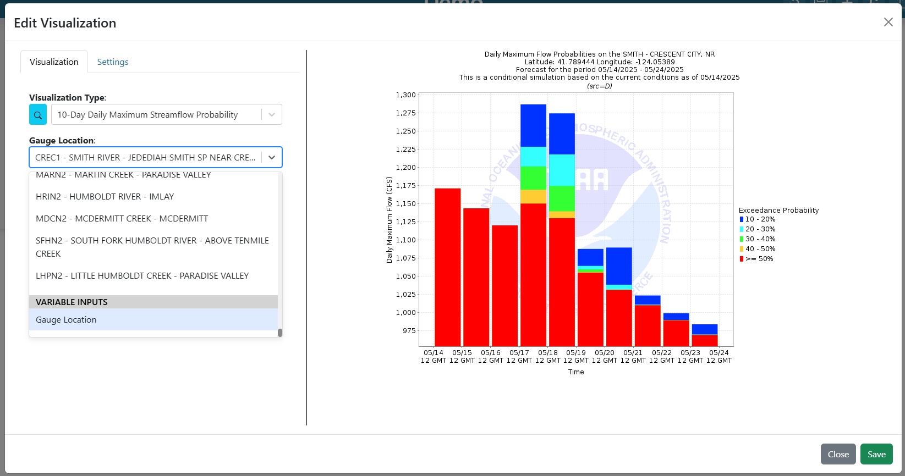

Variable Inputs
===============

.. _variableinputs:

Variable inputs are a way to make dashboards more dynamic. Instead of making multiple dashboards to view the same 
visualizations with slightly different arguments, users can use variable inputs to dynamically change visualizations 
within the dashboards.

In the example below, a user can use variable inputs to simplify data analysis for multiple sites. Instead of creating 
3 unique dashboards to view similar data for 3 different gauge locations, a user can make a single dashboard with 
visualizations that are tied to a variable input dropdown. When the user updates the variable input dropdown, the 
connected visualizations will automatically recognize the change and update accordingly.

.. video:: ../videos/variable_input_example.mp4
    :autoplay:
    :loop:
    :nocontrols:
    :class: variable-input-video

Set Up
------

.. image:: ../images/variable_input_setup.png

Usage
-----

